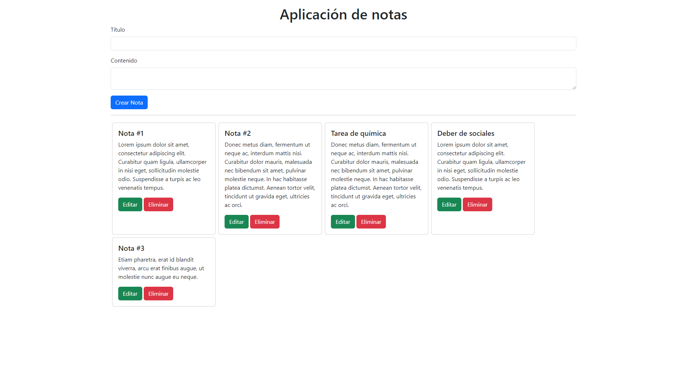

# Aplicación de notas

Esta es una aplicación de notas que permite al usuario crear, leer, actualizar y eliminar notas. La aplicación está desarrollada en JavaScript y html, con el framework de css Bootstrap.

Cristhian Bacusoy &copy; 2024

